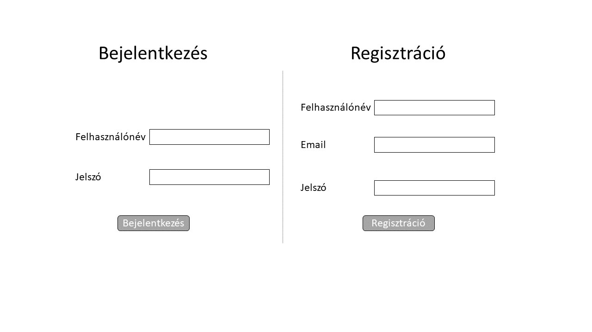
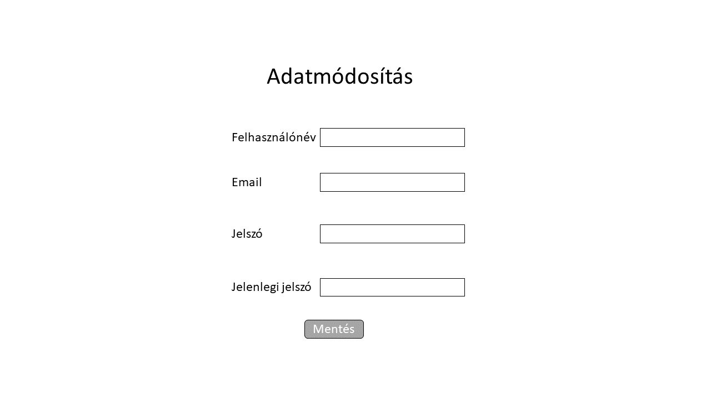
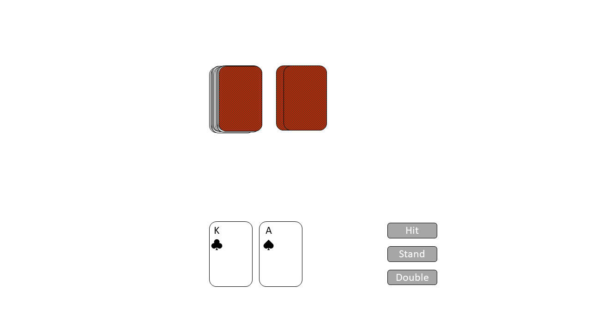

# Funkcionális specifikáció

## 1. Bevezetés
Alapvetően a szerencsejáték a társadalom egy széles körét érinti és érdekli. 
Viszont nem sok ember szeretne rá pénzt és befektetést vagy akár vagyontárgyat áldozni mivel nincs abban a társadalmi helyzetben, 
hogy megengedhetné magának, vagy csak egyszerűen nem szándékozik rá tekinteni többként, mint szórakozás vagy nevéből adódóan játékként.
Ezért gondoltuk - én és munkatársaim -, hogy nem lenne rossz ötlet elkészíteni egy olyan internetes oldalt, 
ahol az egyén képes szerencsejátékokkal játszani anélkül, 
hogy bármilyen fizetőeszközt vagy vagyont bele kelljen áldozni a szenvedélyükbe.
A játékokhoz tartozni fog egy szabályrendszeroldal is ahonnan az is meg tudja tanulni az aktuális játék alapjait aki soha életében nem játszott még velük. 
A játékokban álltalában (a szerencsén kívül természetesen) a játékos legnagyobb képessége a valószínűségszámítás lesz, 
így amelyik játékosnak jobb matematikai tudása van, nagyobb eséllyel nyer.
A játékos a gép ellen mérettetheti meg a játékokban szerzett tapasztalatait, és szerezhet még több gyakorlatot bennük.
A játékot webes felületen fogjuk elkészíteni, regisztráció és belépés után játszhatunk is a szerencsejátékokkal.

## 2. Jelenlegi helyzet
A megrendelő egy egyszerű és könnyen kezelhető alkalmazást szeretne, 
ahol a szerencsejátékok kedvelői képesek élvezni azokat anélkül, hogy az idejüknél többet kellene rá költeni. 
Az említett szoftvert a megrendelő webes felületen szeretné használni, regisztrációval és azután belépéssel.
Az ügyfél ragaszkodott egy egyszerű és könnyen megérthető de mindent átfogó szabályzati oldalhoz azért, 
hogy aki nem ért a játékokhoz is, megtudja tanulni az alapokat. 
Az ügyfél ragaszkodott még ahhoz is, hogy az oldal szabványos legyen, 
és ez mellett még egy modern dizájnt és külsőt is kapjon. Jelenleg a program létrehozásához, 
elkészítéséhez szükséges adatokat, tevékenységeket discord segítségével, minden héten, hetente többször is egyeztetjük.

|**Szerencsejátékok**|
|--------|
|Blackjack|
|Poker|
|Slot Machine|

## 3. Vágyálom rendszer
A fejlesztőcsapat célja egy valósággal megegyező szerencsejáték oldal létrehozása, 
melyben három fajta szerencsejátékot tudunk játszani. 

Szerencsejátékok:

- Blackjack: A játékmenet során a játékosnál lévő lapok összértéke több legyen az osztó lapjainak összértékénél, anélkül, hogy meghaladná a 21-et.
- Póker: A játékosok a  nyílt vagy zárt kártyáikból a legjobbat kihozva elvigyék az asztal közepén lévő kasszát.
- Slot Machine: A játékos a kívánt téttel a szerencsére bízva, a "kar" segítségével megpörgeti a nyerőgépet, és az ez által kiadja a eredményt.

Az "asztaloknál" egyértelműen látható, hogy mekkora a minimális és a maximális tét, 
mely a játékos által felrakható. 
A könnyű regisztráció után egy letisztult bejelentkező panel segítségével a felhasználó könnyű szerrel be tud jelentkezi a saját felhasználói fiókjába. 
A játékok kezdetén a játékosok beteszik a tétjüket az úgynevezett fogadó zónájukba, és aki nyer, az nyeri az összes tétet. 
A játékosoknak lehetőségük van követni a zsetonjaik számának gyarapodását illetve annak elvesztését, 
ezek mellet egy toplista is található lesz ahol a játékosok láthatják, hogy melyik játékosnak van a legtöbb pontja.

## 4. Feltételek
Az alkalmazásunk létrehozásának alapfeltétele, a JavaScript, 
vagy valamilyen más webprogramozási nyelv. 
SQL adatbázist használtunk, ahol elmentjük a regisztrált adatokat és a zsetonok számát, amikből ranglistát képezünk. 
HTML-ben írjuk meg az oldal leíró részét, és ezzel szabványosítjuk azt. 
CSS-el adunk az oldalunknak külsőt, amivel igényesen, dizájnosan és modernek fog kinézni.

## 5. Jelenlegi üzleti folyamatok modellje
A mai világban a legtöbb embernek nincs elegendő ideje, kockázatértékelése vagy pénzbeli, 
vagyoni és értéki háttere ahhoz, hogy egy élvezhető, szerencsén (vagy egy kis/nagy tapasztalaton) alapuló, 
könnyen kezelhető alkalmi játékokkal játsszon, anélkül hogy ki kellene mozdulnia az illető komfortzónájából, 
bár van rengeteg és még annál is több online felületen elérhető ”szerencsejáték”- okkal foglalkozó weboldal, 
ezeknek a hátránya, hogy:

-   Bonyolult regisztráció
-   Személyazonosság kiadása
-   Bankkártya használata

Ezért arra jutottunk, én és a munkatársaim, hogy egy ingyenes, 
könnyű regisztrációs, szerencsén - de később természetesen tapasztalaton - alapuló alkalmi játékokat szimuláló oldalt hozzunk létre, 
amely felkelti azon emberek érdeklődését akiket mindig érdekeltek 
a szerencsejátékok viszont nem szerettek volna rájuk költeni, vagy akármilyen más veszteséget elszenvedni. 
Ezért mi egyszerű játékok megalkotására törekszünk, amelyek nem mellesleg ingyenesek, 
élvezhetőek és még kifinomultak is, ezenfelül pedig a legkevesebb úgynevezett "bug"-al rendelkezők. 

## 6. Igényelt üzleti folyamatok modellje
Az oldalt azért hozzuk létre, hogy a (szerencsejátékot szerető) emberek a szabad időjükben tudjanak játszani költségvetés, 
és személyi adatok kiadása nélkül. A projektünk egy adatbázissal lesz kapcsolatban, 
mely lokális módon lesz majd elérhető, egy adott hálózaton keresztül. 
A könnyű regisztrációs előnynek köszönhetően, percek alatt már a játékok felületén tudjuk kezelni az oldalt, 
a zsetonok száma mentésre kerül, ez által nem kell minden alkalommal újból és újból az elejétől kezdeni a játékot, 
ennek köszönhetően a felhasználók nagyobb kedvvel fogják alkalmazni a program adta lehetőségeket. 
Az oldalon a megadott játékok mellett található lesz mindegyikhez egy-egy szabályzat és a felhasználók zsetonjainak számát összevető ranglista oldal is. 

## 7. Használati esetek
A Játékos az alábbi tevékenységeket végezheti általánosan:

-   Regisztrálhat és törölhet fiókokat
-   Öt percenként ingyen 25 zsetont kérhet
-   Megtekintheti a zsetonjai számát
- 	Megtekintheti a ranglistát

A Játékos az alábbi tevékenységeket végezheti a "Blackjack" játékban:

-   Játék felületen, az ”osztótól” géptől lapot kérhet
-   Abbahagyhatja a lapkérést
-   Megtekintheti az aktuális játék eredményét a képernyőn megjelenő "Nyertél xy zsetont!", "Vesztettél xy zsetont!"
-   Lehetősége van eldobni a kártyáit
-   A játékot bármely pillanatban abbahagyhatja az oldal bezárásával, ilyenkor automatikusan kilép a bejelentkezett fiókból, a bejelentkezetett fiók zsetonjainak száma mentődik.
-   Lehetősége van játék közben használni a súgót, mely megjeleníti melyik lap, mennyi pontot ér.
-   Két kártyás huszonegy (blackjack) esetén a feltett tét másfélszeresét (1,5x) nyeri a játékos.

A Játékos az alábbi tevékenységeket végezheti a "Poker" játékban:

-  	A játékot bármely pillanatban abbahagyhatja az oldal bezárásával, ilyenkor automatikusan kilép a bejelentkezett fiókból, a bejelentkezetett fiók zsetonjainak száma mentődik.
- 	Lehetősége van játék közben használni a súgót, mely megjeleníti melyik lap, mennyi pontot ér.
- 	Megtekintheti az aktuális játék eredményét a képernyőn megjelenő "Nyertél xy zsetont!", "Vesztettél xy zsetont!".
-   Lehetősége van eldobni a kártyáit.
- 	Ki tudja teríteni a kártyáit.

A Játékos az alábbi tevékenységeket végezheti a Poker játékban:

- 	A játékot bármely pillanatban abbahagyhatja az oldal bezárásával, ilyenkor automatikusan kilép a bejelentkezett fiókból, a bejelentkezetett fiók zsetonjainak száma mentődik.
- 	Megtekintheti az aktuális játék eredményét a képernyőn megjelenő "Nyertél xy zsetont!", "Vesztettél xy zsetont!".
- 	Lehetősége van a nyerőgép karjának "meghúzására".

## 8. Képernyőtervek
Fontosabb képernyők:
- regisztráció / bejelentkezés

- adatmódosítás

- részlet a "Blackjack" játékből

## 9. Forgatókönyvek
### Játékmenet forgatókönyve: Blackjack

Szereplők: Webalkalmazás

Bejelentkezve lehet játékot indítani. A játékos tétet választ, majd az osztó és a játékos is 2-2 lapot kap.

A játékos 3 lépés közül választhat:

-   **Hit**  (lapkérés): az osztó 1 új lapot ad a játékosnak. Ismételhető.
-   **Stand**  (megállás): a játékos nem húz több lapot.
-   **Double**  (tét emelés): a korábbi tétet megkétszerezi.

Ha a játékos végzett, az osztó lapjait felfedve meghatározzuk a kör nyertesét. 
Ha a játékos nyert, a tét értéke hozzáadódik zsetonjai számához, ellenkező esetben levonódik belőle. 
Ha elfogytak a zsetonjai, a játék véget ér. A játékot az admin tudja újraindítani minden játékosnak.

### Játékmenet forgatókönyve: Póker

Szereplők: Webalkalmazás, SQL adattábla

Bejelentkezve lehet játékot indítani. A játékos tétet választ, majd a játékos és a másik játékos is fejenként 2-2 lapot kap.

A játékos 2 lépés közül választhat:

-   **Call**  (folytatás): a játékos folytatja a játékot, újabb lapok fordulnak fel. 
-   **Fold**  (bedobás): a játékos eldobja a lapjait ezzel elveszíti ezt a kört és a feltett zsetonjait.

Ha a játékos végzett, összevetjük a két játékos lapjait és akinek a legjobb "keze" van az nyert.
Ha a játékos nyert, a tét értéke hozzáadódik zsetonjai számához, ellenkező esetben levonódik belőle. 
Ha elfogytak a zsetonjai, a játék véget ér. A játékot az admin tudja újraindítani minden játékosnak.

### Játékmenet forgatókönyve: Slot Machine/Nyerőgép

Szereplők: Webalkalmazás, SQL adattábla

Bejelentkezve lehet játékot indítani. A játékos tétet választ, majd meghúzza a nyerőgép karját.

A játékos 2 lépés közül választhat:

-   **Again**  (folytatás): a játékos újra játszik, újabb tétet kell tennie.
-   **Leave**  (befejezés): a játékos "feláll" a nyerőgéptől, ezáltal otthagyja azt.

Ha a játékosnak kedvezett a szerencse és a nyerőgép akkor megnyeri a feltett tét dupláját, ellenkező esetben pedig bukja mindet.
Ha elfogytak a zsetonjai, a játék véget ér. A játékot az admin tudja újraindítani minden játékosnak.