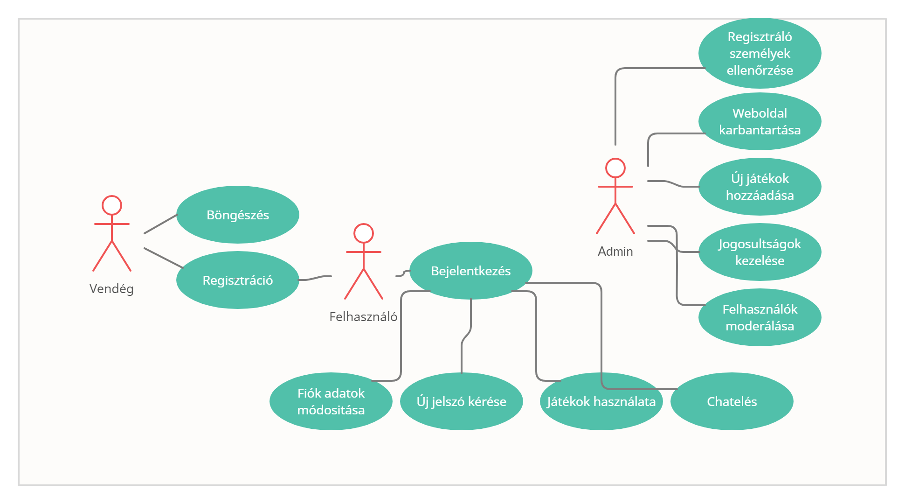
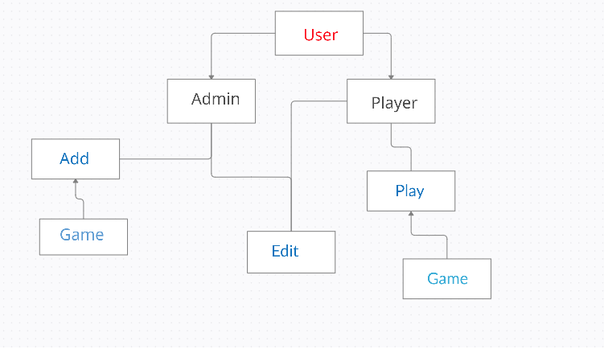
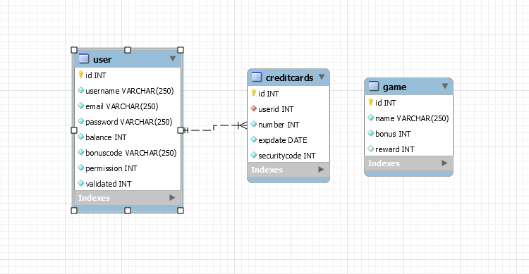

# Rendszertervek

## 1. Rendszer célja

A rendszer célja, hogy létrehozzunk egy ingyenes online "Szerencsejáték" (casino) játékot, melyben a játékosok pontszerzéssel képesek a tabellán feljebb és feljebb jutni, az eredményes játékosokat később jutalomban részesülnek.

A "Póker - és a BlackJack (huszonegy) - kártyajáték" esetében a játékos képes tétet tenni, ahogy az ellenfele is, aki nyer az viszi mindet amit feltettek tétnek, és az hozzá lesz adva a nyertes számlájára. További lehetőség még az úgynevezett Nyerőgép (Slot Machine) takarja az egyjátékos részét a projektünknek, mivel itt a játékos a kívánt tétettel a szerencsére bízva, a "kar" segítségével a nyerőgép megpörög, és ez által kiadja az eredményt. 

A játékhoz regisztrálni kell és belépni, hogy használni tudjuk a program adta lehetőségeket.

A számla egyenlege minden játék után mentésre kerül, így ha újra játszani szeretnénk akkor ugyanonnan kezdhetjük, ahol befejeztük.

Külön fel lesznek tüntetve a játékszabályok az egyes játékokra, mely belépés nélkül is megtekinthető.

Ha a játékosnak elfogy az egyenlege akkor 5 perc várakozási idő után ingyen 500 zseton adódik a számlájához, ez a bónusz, csak akkor lép érvénybe, ha a játékosnak ténylegesen elfogy, azaz 0 zsetonnal rendelkezik.

## 2. Projekt terv

Projekt szerepkörök, felelősségek

| Szerepkör | Személy|
|---|:-|
| - Senior fejlesztők: | Balogh Dániel, Soós Gergó,   Vajda Krisztián |
|    - Junior fejlesztők: | Kurán Bertalan, Lehóczky Csaba, Pusztai Dominik Tamás, Zsadányi Rózsa |
##
|  Felelőségek  |  |
|---|:-|
| Senior fejlesztő: | A junior fejlesztők munkájának felügyelete és megkönnyítése tanácsadás által, segíthetnek kisebb projektelemek elkészítésében is. |
| Junior fejlesztő: | A projekt elkészítése. Projekt munkások és felelősségeik |
##
| Funkció / Story | Feladat / Task| Prioritás| Becslés | Aktuális becslés|Eltelt idő|Hátralévő idő|
|---|---|---|---|---|---|---|
| Követelmény specifikáció||0|7|7|6|0|
| Funkcionális specifikáció||0|7|7|6|0|
| Rendszerterv||0|7|7|6|0|
| Adattárolás|Adatmodell megtervezése|0|4|4|4|0|
| |Adatbázis megvalósítása a szerveren|1|3|3|3|0|
| Login felület|Felület kinézete|1|4|4|4|0|
| BlackJack|Játék elkészítése|3|10|10|8|2|
| Poker|Játék elkészítése|3|10|10|0|10|
| Slot Machine(Nyerőgép)|Játék elkészítése|3|10|10|0|10|

A projektet weblapra fejlesztjük front- és back -end segítségével. Az elkülönített feladatokon más-más emberek dolgoznak.

### Frontend felelősök:

Frontend fejlesztése HTML/CSS segítségével

A feladat célja, hogy egy letisztult, könnyen kezelhető, igényes weblapot nyújtson a felhasználó számára.

### Backend felelősök:

Feladatuk a háttérben működő programok megírása, randomizálás, JavaScript kód, adatbázis kezelése, az eredmény kiértékelés, és az értékek mentése.

## 3. Üzleti folyamatok modellje

## 4. Követelmények

Funkcionális követelmények:
- A regisztrált felhasználók tárolása
    - A felhasználók csoportba szervezése
    - Webes felületen gördülékeny működés
- Nem funkcionális követelmények:
    - Letisztult kinézet
    - A programnak egyszerűnek kell lennie , ezért a teljesítménye sem lehet nagy

A rendszer fejlesztése HTML/CSS valamint JavaScript és php segítségével történik.
A weblap felépítése, valamint dizájnolása a HTML/CSS nyelv implementálásával valósítandó meg.
A weboldal használatához egy egyszerű böngészőre van szükség.

## 5. Funkcionális terv

Rendszerszereplők:

- Játékos
- Admin

Rendszerhasználati esetek és lefutásaik:

- Játékos:
    - Regisztráció az oldalra
    - Saját adatainak módosítása
    - A játékban való részvétel
	
- Admin:
    - Beléphet bármilyen szereplőként teljes hozzáférése van a rendszerhez
    - A felhasználói adatokat látják, változtathatják
	- Felhasználó hozzáadására, törlésére van lehetőségük
	- Felhasználói adatok módosítása
	
Menü-hierarchiák:

- BEJELENTKEZÉS
 	- Bejelentkezés
	- Regisztráció
	- Help

- MAIN MENU
	- Játékszabályok 
	- BlackJack(huszonegy) játék 
	- Poker játék 
	- Slot Machine(nyerőgép) játék
	- Kilépés
	- Felhasználók megjelenítése(Admin)

## 6. Fizikai környezet

Az alkalmazás webes platformra készül.
Van tűzfal a hálózaton és engedélyezi a 80-as (HTTP) és a 443-as (HTTPS) portokat.
Nincsenek megvásárolt komponenseink.
Fejlesztői eszközök:

	- Notepad ++
    - Visual Studio Code / Netbeans / IntelliJ WebStorm
    - WAMP / XAMPP server
	- HEROKUAPP / Felhő alapú adatbázis kezelő rendszer MySQL Workbench-el összecsatlakoztatva
    - git
	
## 7. Absztrakt domain modell	

	
| Megnevezés | Mezők | Leírás| Kapcsolat|
|---|---|---|---|
| User|id, username, password, e-mail|Abstract user osztály|Gyermek osztályai: Admin, Player|
| Admin|permission|Adminokat valósít meg|A User gyermekosztálya|
| Edit|id, username, password, e-mail| Playereket módosít meg| Az Edit egy player-hez tartozik|
| Add |gameId, bonus, reward|Játékot ad hozzá|Az "Add" egy játékhoz tartozik|
| Play | gameId, userId|User használja a játékot| A "Play" egy játékhoz tartozik|

	
## 8. Architekturális terv

### Backend

A rendszerhez szükség van egy adatbázis szerverre,
ebben az esetben MySQL-t használunk.
A kliens oldali programokat egy PHP alapú REST API szolgálja ki,
ez csatlakozik az adatbázis szerverhez.
A kliensekkel JSON objebktumokkal kommunikál.

### Web kliens

A webalkalmazás JavaScript haszálatával készül el.
A REST API-hoz a user belépését követően egyedi api-key segítségével
lehet hozzáférni, ez biztosítja, hogy illetéktelen felhasználok ne
módosíthassák az adatokat, és ne tudják felhasználni a rendszer adta lehetőségeket.

## 9. Adatbázis terv

## 10. Implementációs terv

A Webes felület főként HTML, CSS, PHP, és Javascript nyelven fog készülni.
Ezeket a technológiákat amennyire csak lehet külön fájlokba írva készítjük el, és úgy fogjuk egymáshoz csatolni a jobb átláthatóság, és könnyebb bővítés érdekében. 
Képes lesz felhasználni a Backend részen futó REST szolgáltatás metódusait, ezáltal tud felvinni és lekérdezni adatokat az
adatbázisból.

## 11. Tesztterv

Az projekt alkalmazása elkészítése során szükség van a folyamatos tesztelésekre.\
Tesztelni kell a gombok működését, valamint a pontszám változását, ha a játékos nyer, illetve veszít, és az új játék kezdésekor a meglévő pontszám megjelenítését\
Tesztelni kell, hogy a dizájn megjelenik-e és/vagy úgy jelenik meg ahogy mi szerettük volna, és változtatás esetén megváltozik-e mindenhol ahol szerettük volna.\
Azt is tesztelni kell, hogy az adatbázis megfelelően dolgozik azaz megfelelően tárolja el a dolgokat, és dolgozza fel a funkcióknak megfelelően.
A maradék backend kódokat is többszörösen kell tesztelni, hogy megfelelően működnek-e, ezzel megelőzve a korai hibákat, és a későbbi hibákat is.

- Tesztelési eljárások:
	- Unit teszt:
	Ahol csak lehetséges, szükséges már a fejlesztési idő alatt is tesztelni, hogy a
	metódusok megfelelően működnek-e.
	Ezért a metódusok megfelelő működésének biztosítására mindegyikhez írni
	kell Unit teszteket.
	- Alfa teszt:
	Meglévő funkcióknak a különböző
	böngészőkkel való kompatibilitásának tesztelése. A tesztet a
	fejlesztők végzik.

## 12. Telepítési terv

Az alkalmazás futtatásához egy általános felhasználású böngészőre van szükség.\
Az alkalmazás eléréséhez regisztrációra van szükség, melybe később be kell jelentkezni, ez az adat tárolódik, a későbbi felhasználás esetére.

## 13. Karbantartási terv

Az alkalmazás bővítési lehetőségét fenntartjuk. A későbbiekben a játékon belüli "in-game"  vásárlás lehetőségét biztosítjuk, melyet az elért pontszámókból vonjuk le.\
A későbbiekben további játék-lehetőségek opcióját fenntartjuk..